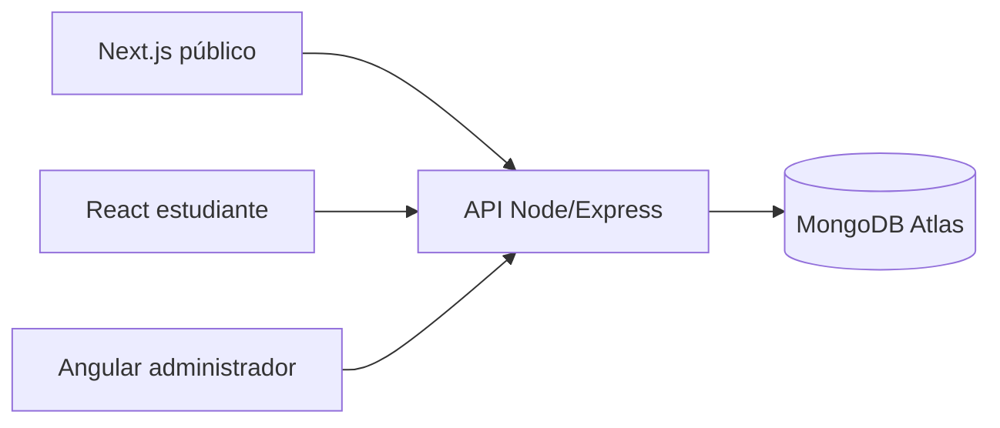

# Plataforma de Gestión de Cursos e Inscripciones

Proyecto integrador full stack de Programación Web II. La solución permite publicar un catálogo de cursos, autenticar estudiantes y administradores, gestionar inscripciones y administrar cursos y usuarios desde aplicaciones independientes conectadas a una API REST común.

## Integrantes

- Andrés Oliver Trujillo Torres
- Diego Gallardo Sánchez
- Gabriela Fumiko Furukawa Oki
- Misha Reuven Quito
- Diego Fernando Salva Puerta

La distribución de responsabilidades se documenta en [docs/distribucion-trabajo.md](docs/distribucion-trabajo.md).

## Arquitectura

El repositorio es un monorepo con cuatro aplicaciones desplegadas de forma independiente:

| Módulo | Tecnologías principales | Responsabilidad | Despliegue |
|---|---|---|---|
| `public-next/` | Next.js 16, React 19, App Router | Portada, catálogo público y detalle de cursos con SSG/ISR | Vercel |
| `student-react/` | React 18, Vite 8, React Router, Context API | Catálogo, autenticación, detalle e inscripciones del estudiante | Vercel |
| `admin-angular/` | Angular 21, TypeScript, RxJS, formularios reactivos | Dashboard y CRUD administrativo de cursos y usuarios | Vercel |
| `backend/` | Node.js, Express 4, Mongoose 8, JWT | API REST, autenticación, autorización y persistencia | Render |
| Base de datos | MongoDB Atlas | Usuarios, cursos e inscripciones | MongoDB Atlas |



La arquitectura ampliada está en [docs/arquitectura.md](docs/arquitectura.md) y el detalle de módulos en [docs/modulos.md](docs/modulos.md).

## Aplicaciones desplegadas

| Aplicación | URL de producción |
|---|---|
| Backend Node/Express | https://plataforma-cursos-ei-api.onrender.com |
| Sitio público Next.js | https://plataforma-cursos-ei-public.vercel.app |
| Portal del estudiante React | https://plataforma-cursos-ei-student.vercel.app |
| Panel administrativo Angular | https://plataforma-cursos-ei-admin.vercel.app |

## Módulos y funcionamiento

### Next.js público

- `/`: portada estática.
- `/cursos`: catálogo público con regeneración incremental.
- `/cursos/[id]`: detalle prerenderizado de cada curso.
- Consume únicamente endpoints públicos del backend y no requiere autenticación.

### React estudiante

- Catálogo y detalle público de cursos.
- Login y registro de estudiantes.
- Ruta protegida `/mis-inscripciones`.
- Context API mantiene el usuario autenticado y recupera la sesión con `/api/auth/me`.
- Las rutas protegidas validan el rol `student`; un administrador recibe una pantalla de acceso restringido.

### Angular administrador

- Login exclusivo para administradores.
- Dashboard con cantidades de cursos y usuarios.
- CRUD de cursos y usuarios con formularios reactivos.
- Guard de rutas para el rol `admin` e interceptor HTTP para enviar el JWT.
- Las recargas directas se resuelven mediante la reescritura SPA configurada en Vercel.

### Backend Node/Express

- Endpoints públicos de salud y consulta de cursos.
- Autenticación JWT y autorización por roles.
- Validación con `express-validator` y modelos Mongoose.
- Contraseñas almacenadas como hash con bcrypt y excluidas de las respuestas normales.
- Seguridad con Helmet, CORS por lista blanca y límite de solicitudes.

## Autenticación y roles

El login devuelve un JWT firmado que contiene la identidad y el rol. React y Angular guardan temporalmente el token en `localStorage` y lo envían como `Authorization: Bearer <token>` en solicitudes protegidas.

- `student`: puede acceder a sus inscripciones y solicitar una inscripción.
- `admin`: puede administrar cursos y usuarios.
- El backend valida el token con `verifyToken` y aplica autorización con `requireRole`.
- Una sesión ausente o inválida produce 401; un rol no autorizado produce 403 o una redirección controlada en el frontend.

## Instalación local

Requisitos: Node.js compatible con cada `package.json`, npm y acceso a una base MongoDB.

```bash
git clone https://github.com/andresolivertrujillo/plataforma-cursos-ei-final.git
cd plataforma-cursos
```

### Backend

```bash
cd backend
cp .env.example .env
npm ci
npm run dev
```

La API local usa el puerto 4000. El seed es opcional y debe ejecutarse una sola vez en una base preparada:

```bash
npm run seed
```

### Sitio público Next.js

```bash
cd public-next
cp .env.example .env.local
npm ci
npm run dev
```

### Portal React

```bash
cd student-react
cp .env.example .env
npm ci
npm run dev
```

### Panel Angular

```bash
cd admin-angular
npm ci
npm start
```

El entorno local de Angular se define en `src/environments/environment.ts`; producción usa `environment.prod.ts` mediante `fileReplacements`.

## Variables de entorno requeridas

Los archivos reales `.env` no deben publicarse. Configura únicamente los valores en el entorno local o en el proveedor de despliegue.

### Backend

- `PORT`
- `MONGODB_URI`
- `JWT_SECRET`
- `JWT_EXPIRES_IN`
- `CORS_ORIGINS`
- `SEED_ADMIN_NAME`
- `SEED_ADMIN_EMAIL`
- `SEED_ADMIN_PASSWORD`
- `SEED_STUDENT_NAME`
- `SEED_STUDENT_EMAIL`
- `SEED_STUDENT_PASSWORD`

### Next.js público

- `NEXT_PUBLIC_API_URL`

### React estudiante

- `VITE_API_URL`

### Angular administrador

Angular utiliza `apiUrl` en sus archivos `environment.ts` y `environment.prod.ts`; no requiere una variable de entorno adicional en Vercel con la configuración actual.

## Credenciales de prueba

Las credenciales no se publican en el repositorio. Para obtenerlas:

1. Solicítalas al responsable del proyecto por un canal privado; o
2. consulta localmente las variables `SEED_ADMIN_EMAIL`, `SEED_ADMIN_PASSWORD`, `SEED_STUDENT_EMAIL` y `SEED_STUDENT_PASSWORD` del archivo `backend/.env` autorizado.

Nunca copies contraseñas, tokens, URI de MongoDB ni secretos JWT en documentación, capturas, issues o commits.

## Uso básico

1. Abre el sitio público para consultar los cursos sin iniciar sesión.
2. En el portal React, inicia sesión como estudiante para acceder a **Mis inscripciones**.
3. En el panel Angular, inicia sesión como administrador para gestionar cursos y usuarios.
4. Usa **Salir** para eliminar la sesión local; las rutas protegidas vuelven al login.

## Endpoints principales

| Método | Ruta | Acceso |
|---|---|---|
| GET | `/` | Público |
| GET | `/api/health` | Público |
| POST | `/api/auth/register` | Público |
| POST | `/api/auth/login` | Público |
| GET | `/api/auth/me` | Autenticado |
| GET | `/api/courses` | Público |
| GET | `/api/courses/:id` | Público |
| POST / PUT / DELETE | `/api/courses` | Admin |
| POST | `/api/enrollments` | Student |
| GET | `/api/enrollments/mine` | Student |
| GET | `/api/enrollments` | Admin |
| GET / POST / PUT / DELETE | `/api/users` | Admin |

La colección de pruebas está en [docs/postman_collection.json](docs/postman_collection.json).

## Auditoría Lighthouse

Reportes generados con Lighthouse 13.4.1, modo escritorio:

| Aplicación | Performance | Accessibility | Best Practices | SEO | Agentic Browsing |
|---|---:|---:|---:|---:|---:|
| Next.js público | 100 | 98 | 96 | 100 | 100 |
| React estudiante | 100 | 97 | 100 | 82 | 67 |
| Angular administrador | 100 | 96 | 100 | 82 | 67 |

Reportes HTML:

- [public-next.html](docs/lighthouse/public-next.html)
- [student-react.html](docs/lighthouse/student-react.html)
- [admin-angular.html](docs/lighthouse/admin-angular.html)

La metodología y observaciones están en [docs/lighthouse.md](docs/lighthouse.md).

## Estructura principal

```text
plataforma-cursos/
├── backend/             API REST, modelos, rutas, controladores y seed
├── public-next/         sitio público Next.js
├── student-react/       portal React del estudiante
├── admin-angular/       panel administrativo Angular
├── docs/                arquitectura, seguridad, API y Lighthouse
├── README.md            guía principal
└── GUIA_PASO_A_PASO.md guía complementaria de despliegue y entrega
```

## Verificación final

- Los tres frontends compilan correctamente en modo producción.
- El backend desplegado responde en `/`, `/api/health` y `/api/courses`.
- Las rutas internas de las SPA soportan recarga directa.
- Las restricciones de rol y logout fueron comprobadas en producción.
- La base final contiene 2 usuarios, 5 cursos y 0 inscripciones.
