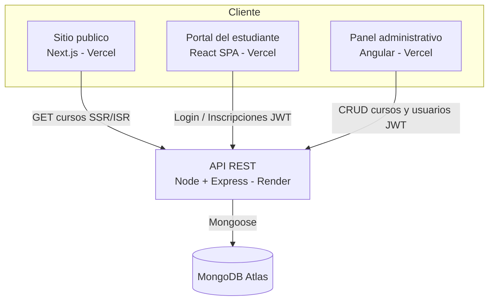

# Arquitectura del sistema

La solucion es una plataforma de gestion de cursos e inscripciones compuesta por
cuatro aplicaciones desplegadas de forma independiente que consumen una unica API REST.

## Diagrama de arquitectura

## Descripcion de cada capa

| Capa | Tecnologia | Responsabilidad | Despliegue |
|------|-----------|-----------------|------------|
| Sitio publico | Next.js (App Router) | Catalogo y detalle publico con SSR/ISR/SSG | Vercel |
| Portal estudiante | React + Vite + React Router + Context API | Registro, login, catalogo, inscripcion, panel del estudiante | Vercel |
| Panel admin | Angular (standalone) + TypeScript | CRUD de cursos y usuarios, dashboard | Vercel |
| API | Node.js + Express + Mongoose | Autenticacion JWT, roles, logica de negocio | Render |
| Base de datos | MongoDB Atlas | Persistencia de usuarios, cursos e inscripciones | MongoDB Atlas |

## Flujo de negocio principal

1. El visitante ve el catalogo publico (Next.js).
2. Se registra o inicia sesion en el portal del estudiante (React).
3. Consulta el catalogo, entra al detalle de un curso y se inscribe.
4. Revisa sus inscripciones en su panel.
5. El administrador (Angular) gestiona cursos y usuarios (CRUD) y ve el total de inscripciones.
6. Todo se persiste en MongoDB Atlas a traves de la API.

## Seguridad transversal

- Contrasenas hasheadas con bcrypt.
- Autenticacion con JWT y autorizacion por roles (admin / student).
- Helmet, CORS restringido, rate limiting y validacion de entradas en el backend.
- HTTPS provisto por Vercel y Render.
