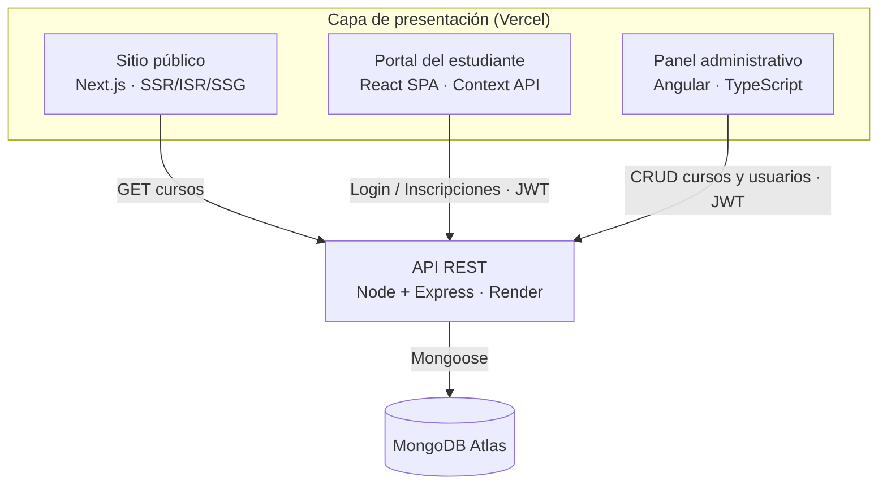
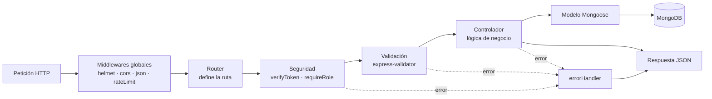
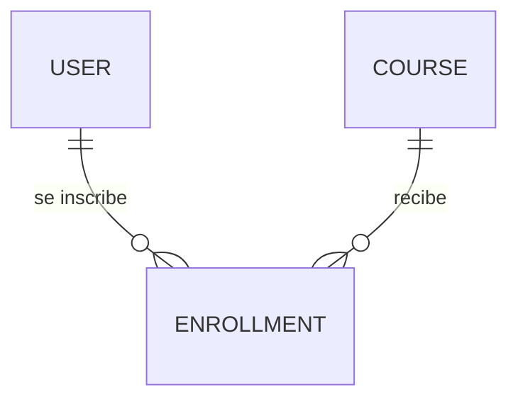
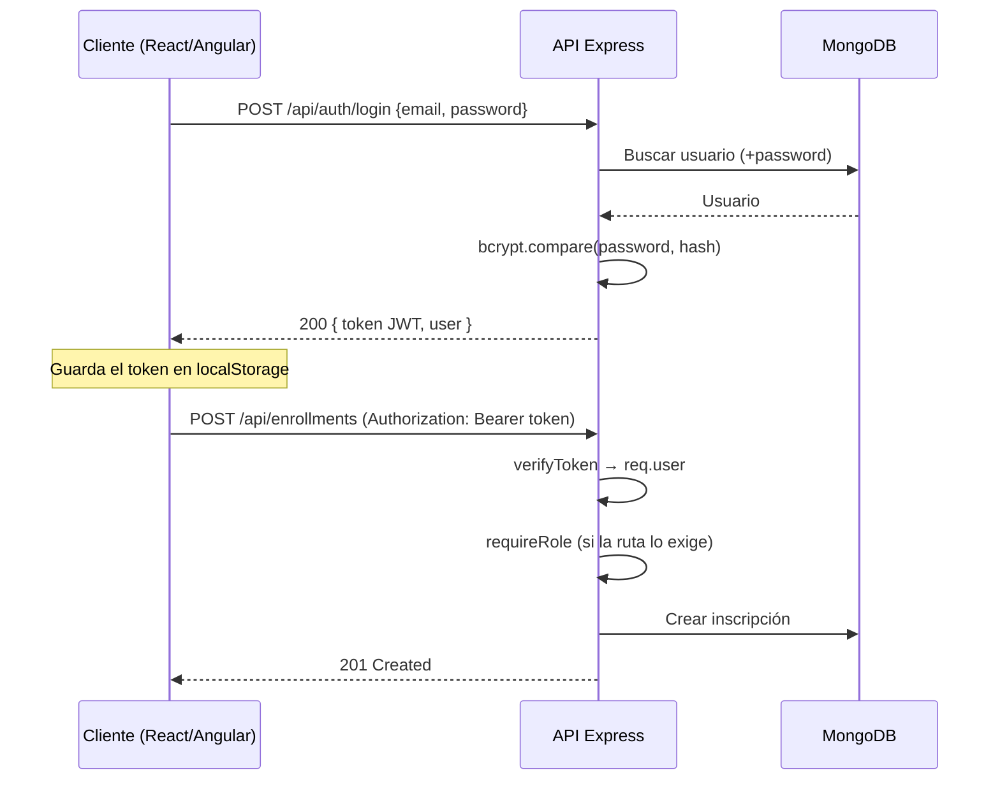
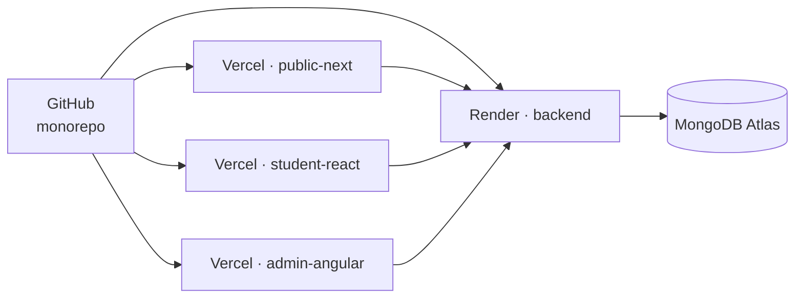

# Arquitectura del sistema

La solución es una plataforma de gestión de cursos e inscripciones compuesta por
**cuatro aplicaciones desplegadas de forma independiente** que consumen una única API
REST, la cual a su vez persiste todo en MongoDB Atlas.

---

## 1. Visión general

### ¿Por qué cuatro aplicaciones y no una?

Porque cada una atiende a un público con necesidades técnicas distintas:

- El **sitio público** debe cargar rápido y ser indexable → renderizado en servidor.
- El **portal del estudiante** es una experiencia interactiva tras el login → SPA.
- El **panel administrativo** es una herramienta interna con formularios complejos →
  Angular y sus formularios reactivos.
- La **API** concentra la lógica de negocio una sola vez y las tres la reutilizan.

Esto es *frontend desacoplado*: si mañana se agrega una app móvil, consume la misma API
sin tocar el backend.

---

## 2. Responsabilidad de cada capa

| Capa | Tecnología | Responsabilidad | Despliegue |
|------|-----------|-----------------|------------|
| Sitio público | Next.js (App Router) | Catálogo y detalle público con SSR/ISR/SSG | Vercel |
| Portal estudiante | React + Vite + React Router + Context API | Registro, login, catálogo, inscripción y panel del alumno | Vercel |
| Panel admin | Angular standalone + TypeScript | CRUD de cursos y usuarios, dashboard | Vercel |
| API | Node.js + Express + Mongoose | Autenticación JWT, roles, reglas de negocio | Render |
| Base de datos | MongoDB Atlas | Persistencia de usuarios, cursos e inscripciones | MongoDB Atlas |

El detalle archivo por archivo está en [`modulos.md`](modulos.md).

---

## 3. Arquitectura interna del backend

El backend sigue una separación por capas. Cada petición atraviesa siempre el mismo
camino:

Ventaja práctica de esta separación: la seguridad y la validación se resuelven **antes**
de llegar a la lógica de negocio, así que los controladores quedan limpios y asumen que
los datos ya son confiables. Y como todos los errores desembocan en `errorHandler`, el
cliente siempre recibe el mismo formato de error.

---

## 4. Modelo de dominio

Tres entidades. El detalle de campos está en [`modelo-datos.md`](modelo-datos.md).

`Enrollment` es la tabla intermedia de una relación muchos-a-muchos entre estudiantes y
cursos, con un **índice único compuesto** `{student, course}` que impide inscripciones
duplicadas desde la propia base de datos.

---

## 5. Flujo de autenticación y autorización

Puntos clave para la sustentación:

- **La contraseña nunca se guarda en texto plano.** Un hook `pre('save')` del modelo
  `User` la hashea con bcrypt, y el campo tiene `select: false` para que no se devuelva
  en las consultas.
- **El backend es stateless.** No guarda sesiones: toda la identidad viaja firmada
  dentro del JWT. Por eso escala y por eso funciona en Render sin estado compartido.
- **Autenticación ≠ autorización.** `verifyToken` responde "quién eres" (401 si falla);
  `requireRole` responde "qué puedes hacer" (403 si falla).

---

## 6. Estrategias de renderizado

| App | Estrategia | Motivo |
|-----|-----------|--------|
| Next.js `/` | Estática | Contenido fijo |
| Next.js `/cursos` | **ISR** (`revalidate = 60`) | Catálogo rápido que se refresca solo |
| Next.js `/cursos/[id]` | **SSG** (`generateStaticParams`) | Una página prerenderizada por curso |
| React | CSR (SPA) | Contenido privado y muy interactivo; no necesita SEO |
| Angular | CSR (SPA) | Herramienta interna tras login |

---

## 7. Manejo de estado

| App | Mecanismo | Qué guarda |
|-----|----------|-----------|
| React | **Context API** (`AuthContext`) + `localStorage` | Usuario autenticado y token; lo consumen Navbar, rutas protegidas y páginas |
| Angular | Servicios inyectables (`providedIn: 'root'`) | Singleton de sesión; el interceptor añade el token a cada petición |
| Next.js | Sin estado de cliente | Los datos llegan ya resueltos desde el servidor |

Se eligió Context API sobre Redux porque el estado global es pequeño (sesión) y Redux
habría añadido mucho código repetitivo sin beneficio. El requisito de la rúbrica —estado
compartido entre varios componentes— se cumple igual.

---

## 8. Seguridad transversal

| Control | Dónde |
|---------|-------|
| Hash de contraseñas (bcrypt) | Modelo `User` |
| JWT firmado con secreto de entorno | `auth.controller.js` / `verifyToken` |
| Autorización por roles | `requireRole` |
| Cabeceras de seguridad | `helmet()` |
| CORS restringido por lista blanca | `CORS_ORIGINS` |
| Límite de peticiones por IP | `express-rate-limit` |
| Validación de entradas | `express-validator` + esquemas de Mongoose |
| Secretos fuera del repositorio | `.env` ignorado, `.env.example` versionado |
| HTTPS | Provisto por Vercel y Render |

Checklist completo en [`checklist-seguridad.md`](checklist-seguridad.md).

---

## 9. Topología de despliegue

Un solo repositorio alimenta cuatro despliegues: en Vercel y Render se indica el
**Root Directory** correspondiente y cada plataforma compila solo esa carpeta. La
configuración exacta está en `GUIA_PASO_A_PASO.md`.
