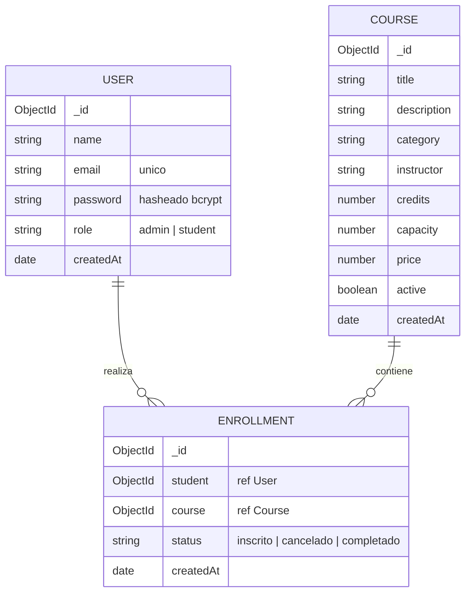

# Modelo de datos

Base de datos: `plataforma_cursos` en MongoDB Atlas. Tres colecciones principales.

## Reglas / validaciones

- `User.email` es unico.
- `Enrollment` tiene indice unico compuesto `{ student, course }`: un estudiante no puede inscribirse dos veces al mismo curso.
- Al inscribirse se valida el cupo (`capacity`) contra el numero de inscripciones activas.
- `credits` entre 1 y 10; `capacity` y `price` no negativos.
